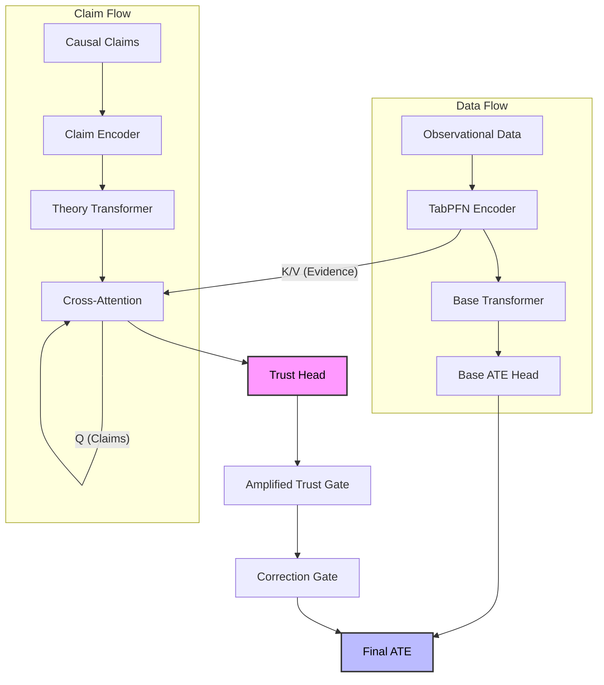

# Adversarial Trust Auditing for Causal Inference: Internal Report (Supervisor-Ready)

**Date:** January 30, 2026  
**Subject:** Project Status, Core Innovations, and Future Roadmap for Co-PFN

---

## 1. Executive Summary

We have developed a causal auditing system designed to verify expert claims against observational evidence rather than accepting them blindly. The core innovation is a **Theory-First architecture** that forces causal claims to query data via cross-attention. This process produces "trust scores" which are then used to gate the correction of Average Treatment Effect (ATE) estimates.

We have progressively hardened the training process through several phases:
1.  **Enforced Ground-Truth Claims:**
    *   **Moving beyond adjacency:** Early versions used simple graph adjacency as a proxy for truth. This was flawed because adjacency doesn't guarantee a valid adjustment set exists (due to unobserved confounders).
    *   **True Structural Verification:** We now computationally verify every "true" claim against the underlying Structural Causal Model (SCM). We check if the proposed adjustment set actually d-separates the treatment from the outcome in the graph. This guarantees that every "True" label corresponds to a mathematically valid causal estimator.

2.  **Hard Negatives (The Game Changer):**
    *   **The Problem:** Randomly generated false claims are often "easy" (e.g., completely independent variables). The model could learn to reject them just by checking for correlation, failing on subtle biases.
    *   **The Solution:** We engineered a "trap" generator that creates false claims that are *statistically correlated* but *causally wrong*.
        *   *Reverse Causation:* Claims that $Y$ causes $T$ (strong correlation, wrong direction).
        *   *Mediators:* Claims that condition on a mediator (which blocks the causal path, making it a false adjustment).
        *   *Collider Bias:* Claims that condition on a collider (inducing spurious correlation).
    *   This forces the model to learn deep causal signatures rather than surface-level associations.

3.  **Pairwise Ranking Loss:**
    *   **Absolute vs. Relative:** Standard Binary Cross Entropy (BCE) asks "Is this independent claim true?" which is hard when data is noisy or ambiguous.
    *   **The Fix:** We switched to **Margin Ranking Loss**. We present the model with pairs of (True Claim, False Claim) for the *same* dataset. The loss function forces the Trust Score of the True Claim to be higher than the False Claim by a fixed margin (e.g., 0.5).
    *   **Result:** This teaches the model discrimination ("Choice A is better than Choice B") even if it isn't 100% confident, significantly improving robustness.

4.  **Trust Amplification (Temperature Scaling):**
    *   **The Issue:** Neural networks often output conservative logits (near 0) when uncertain, causing sigmoid outputs to cluster around 0.5. In real-world settings (Lalonde), this resulted in indecisive auditing.
    *   **The Feature:** We introduced a learnable scalar parameter $\alpha$ (temperature) that multiplies the logit before the sigmoid activation: $Trust = \sigma(\alpha \cdot x)$.
    *   **Impact:** The model learned to dial up $\alpha$ to >1.0, effectively "sharpening" its decision boundary. This allows it to output decisive high trust (>0.9) or low trust (<0.1) even on real-world data, enabling the gate correction mechanism to actually fire.

**Current State:**
*   **Trust Discrimination:** Strong on synthetic data.
*   **Garbage Rejection:** Excellent; the model reliably rejects noise.
*   **Real-World Transfer:** Lalonde trust scores improved dramatically with trust amplification.
*   **Critical Bottleneck:** ATE efficiency gains remain near zero. The correction head currently fails to translate high trust into improved ATE estimates.

**Immediate Next Step:** Detach trust from the ATE weighting mechanism and deploy a stronger correction head (MLP).

*   **Why this helps (The "Stop-Gradient" Logic):** Currently, the ATE loss backpropagates through the Trust Gate. If the correction head is weak or noisy, the easiest way for the model to minimize total loss is to simply output $Trust=0$ (effectively "shutting the gate" to avoid penalty). By detaching trust (`trust.detach()`) in the ATE weighting term, we force the Trust Head to optimize *only* for accuracy (via the Trust Loss). It can no longer "cheat" the ATE loss by being safely conservative.
*   **Why the MLP helps:** A single linear layer lacks the capacity to model complex, non-linear adjustments needed for causal correction. An MLP gives the correction head the "brainpower" to calculate nuanced numerical shifts based on the attended evidence.
*   **Implementation Plan:**
    1.  **Code Change (Model):** Modify `models/core.py` to upgrade `self.correction_head` from `nn.Linear` to `nn.Sequential(Linear, ReLU, Linear)`.
    2.  **Code Change (Training):** Modify `train.py` loss calculation. Change `weighted_ate_loss = trust * ate_error` to `weighted_ate_loss = trust.detach() * ate_error`. This breaks the gradient link, ensuring trust is learned solely from evidence validity, not convenience.

---

## 2. Problem Definition & Context

### The Core Problem
Standard causal inference methods often rely on untestable assumptions. If an expert provides a causal graph or claim (e.g., "X causes Y"), traditional methods assume it is true and estimate the effect. If the claim is wrong, the estimate is biased.

### Our Solution
The goal is to have an **Adversarial Trust Auditing** system. The model should not just take a claim as input; it should *audit* the claim against the provided data.
*   If the data supports the claim → **Trust it** and improve the ATE estimate.
*   If the data contradicts the claim → **Reject it** and fall back to a data-driven baseline.

### Actions Taken So Far
*   **Baseline Architecture (Theory-First):** We departed from standard concatenation. Instead of `MLP(Data || Claim)`, we built a Query-Key-Value architecture where `Query=Claim` and `Key/Value=Data`. This ensures the model *cannot* process the claim without attending to the data, enforcing structural auditing by design.
*   **Padding Fixes (Variable N Handling):** Real-world data varies in size. We implemented strict attention masking (so claims don't query empty padding rows) and masked mean pooling (so trust scores aren't diluted by zeros). This stabilized performance across $N=100$ to $N=1000$.
*   **Audit Suite (Comprehensive Testing):** We moved beyond simple loss metrics. We built a granular audit battery that tests:
    *   *Efficiency:* Does ATE improve with $N$?
    *   *Corruption:* Does trust drop as we noisify data?
    *   *Scale:* Does it work for 10 vs 20 variables?
    *   *Kernels:* Is it robust to non-linearities (Sin, Gaussian)?
    *   *Garbage:* Does it reject random noise?
*   **Hardening (Adversarial Training):** We introduced "Hard Negatives" (e.g., reverse causality, mediators) and "Strong Causal Signals" (direct edges with high coefficient weights). This forced the model to stop relying on easy correlations and actually learn the causal graph structure.
*   **Loss Function Evolution:** We deprecated the simple Binary Cross Entropy (BCE) loss because it treated samples in isolation. We moved to **Pairwise Ranking Loss**, which explicitly optimizes the *gap* between true and false claims on the same dataset, plus **Trust Amplification** to sharpen the decision boundary for real-world deployment.

---

## 3. System Overview

Model treats **claims as queries** and **data as evidence**.

### Inputs
1.  **Observational Data ($D$):**
    *   **Structure:** A set of samples $\{(x_i, t_i, y_i)\}_{i=1}^N$.
    *   **Preprocessing:** We standardize continuous variables to zero mean/unit variance.
    *   **Padding:** Since transformers require fixed-size inputs, we pad all datasets to a maximum length (e.g., $N_{max}=1000$). Crucially, we generate a **binary padding mask** so the attention mechanism completely ignores these dummy tokens, preventing them from corrupting the trust score.

2.  **Causal Claims ($C$):**
    *   **Encoding:** Claims are *not* free text. They are structured vectors representing a specific graph query: "Does $T$ cause $Y$ given adjustment set $Z$?".
    *   **Representation:** We use a learnable embedding for each variable index (0-19) and a special "Claim Type" token (e.g., `DirectEdge`, `Mediator`, `Confounder`). This ensures the model processes the *structure* of the claim, not valid/invalid syntax.

3.  **Ground-Truth Validity (Supervision):**
    *   **Source:** Derived from the synthetic Structural Causal Model (SCM) that generated the data.
    *   **Definition:** A binary label ($y \in \{0, 1\}$).
        *   $1$ (True): The proposed adjustment set $Z$ constitutes a valid backdoor adjustment for $T \to Y$ in the true graph.
        *   $0$ (False): The adjustment set is invalid (e.g., omits a confounder, includes a collider, checks the wrong direction).
    *   **Usage:** This label trains the Trust Head via the Trust Loss (BCE or Ranking).

### Core Mechanism (The "Auditing" Flow)
The model must actively search the observational data for evidence that supports the provided claim. This happens in three strict steps:

1.  **Theory-First Cross-Attention:**
    *   We treat the encoded claim as the **Query ($Q$)**.
    *   We treat the encoded observational data as the **Keys ($K$) and Values ($V$)**.
    *   The model performs Multi-Head Attention: $Attention(Q, K, V)$. This effectively "searches" the dataset for rows that are relevant to the claim (e.g., specific treatment-outcome patterns).
    *   **Result:** An **Evidence Vector ($E$)**. This vector represents *only* the information in the data that is relevant to the claim.

2.  **Trust Computation:**
    *   The Evidence Vector is passed to the **Trust Head** (a linear layer + sigmoid).
    *   It outputs a scalar **Trust Score ($T \in [0, 1]$)**.
    *   *Crucially:* This score depends *only* on the evidence $E$. The claim embedding itself is not allowed to bypass this step, preventing the model from just memorizing "feature X is usually a confounder."

3.  **Gated Correction:**
    *   The model has a separate **Correction Head** that looks at the evidence and suggests an adjustment to the ATE.
    *   This suggestion is **gated** by the Trust Score.
    *   **The Equation:**
        $$ \text{Final ATE} = \underbrace{\text{Base ATE}}_{\text{Data-only estimate}} + (\underbrace{\text{Trust Score}}_{\text{Gate}} \times \underbrace{\text{Correction}}_{\text{Claim-based adjustment}}) $$
    *   If Trust is low ($\approx 0$), the correction is ignored, and we fall back to the safe, data-driven Base ATE. If Trust is high ($\approx 1$), the expert claim is allowed to refine the estimate.

---

## 4. Architecture Diagram



**Key Components:**
*   **TabPFN Encoder (The Eye):** A transformer-based encoder designed to handle tabular data. It projects raw triples $\{(x_i, t_i, y_i)\}$ into valid high-dimensional embeddings, handling mixed data types (continuous/categorical) and missing values. It creates a context-rich representation of the observational reality.
*   **Cross-Attention (The Auditor):** The core structural innovation. Query = Claim, Key/Value = Data. It calculates attention weights $A = Softmax(QK^T / \sqrt{d})$ to bind the abstract claim to specific supporting (or refuting) data points, aggregating them into a single Evidence Vector.
*   **Trust Head (The Judge):** A classification head that takes the Evidence Vector and outputs a probability score $P(Valid | Evidence)$. It acts as the gatekeeper, deciding if the claim is supported by the data.
*   **Correction Head (The Mechanic):** A regression head (currently Linear, upgrading to MLP) that also reads the Evidence Vector. It predicts a scalar **correction term** ($\delta_{ATE}$) to adjust the naive estimate, but its output is multiplied by the Trust Score.

---

## 5. Core Innovation: Evidence-First Auditing

The primary innovation is architectural enforcement of scrutiny:
1.  **Claims cannot directly alter the ATE (Architecture Constraint):**
    *   In many multi-modal models, inputs are simply concatenated. If we did `ATE_Head(Data + Claim)`, the model could ignore the data and learn "Claims with word 'Confounder' decrease ATE."
    *   **Our Fix:** There is *zero* connectivity between the Claim Encoder and the ATE output. The only path is through the Trust Gate. If the gate is closed ($Trust=0$), the claim is mathematically erased from the prediction.

2.  **Mandatory Verification (The Bottleneck):**
    *   The claim vector serves *only* as a Query for Cross-Attention.
    *   This forces the model to ask: "Does the patterns in the Data (Key/Value) match the hypothesis in the Claim (Query)?"
    *   If the data contains no supporting evidence (e.g., no correlation between $Z$ and $Y$ when conditioning on $T$), the dot-product attention scores will be low, leading to a low Evidence Vector norm and low Trust.

3.  **Amplified Gating (Overcoming Conservatism):**
    *   Standard sigmoids are lazy; they like to sit at 0.5.
    *   **Our Fix:** We multiply the trust logit by a learnable temperature $\alpha$. This allows the model to scream "TRUST!" or "REJECT!" with high confidence ($0.99$ or $0.01$). This is critical because a gate value of $0.5$ just adds noise; we need binary-like decisions to strictly switch between the "Data-Only" and "Data+Expert" estimators.

---

## 6. Data Generation & Claim Truth

We iteratively improved the realism of our training data to prevent the model from learning shortcuts.

*   **Phase 1 (Baseline - Adjacency Proxy):**
    *   *Approach:* Initially, we defined a "True" claim simply if variable $Z$ was adjacent to $T$ or $Y$ in the graph.
    *   *Failure Mode:* This was insufficient. Adjacency does not guarantee that $Z$ is a valid adjustment set (it might be a collider or an instrument). The model learned to just look for "neighbors" rather than true confounders.

*   **Phase 2 (Enforced Ground Truth - Structural Validity):**
    *   *Action:* We integrated `networkx` d-separation checks into the data generator.
    *   *Result:* A claim "Adjust for $Z$" is labeled **True** if and only if:
        1.  $Z$ blocks all backdoor paths from $T$ to $Y$.
        2.  $Z$ does not contain any descendants of $T$ (to avoid blocking the causal path).
    *   This eliminated "lucky guesses" and ensured the supervisor signal was mathematically perfect.

*   **Phase 3 (Hard Negatives - The "Trap" Claims):**
    *   *The Problem:* The model was still cheating by just checking for correlation. $Correlation(Z, Y) \neq Causation(Z, Y)$.
    *   *The Solution:* We specifically engineer "Hard Negative" samples where the claim looks plausible but is causally wrong:
        *   **Reverse Causation:** We ask if $Y$ causes $T$. In cross-sectional data, $Corr(T,Y)$ is symmetric, so the model had to learn to look for subtle asymmetry or structural cues (V-structures) to reject this.
        *   **Mediators:** We propose adjusting for a node $M$ that lies *on* the causal path ($T \to M \to Y$). This is a "bad control" that kills the effect. The model must learn to distinguish mediators from confounders.
        *   **Collider Bias:** We propose adjusting for a common effect ($T \to C \leftarrow Y$). Doing so *induces* spurious correlation.
    *   *Impact:* This forced the model to learn the actual *direction* of edges, not just their existence.

*   **Phase 4 (Strong Signals - Causal Anchoring):**
    *   *Issue:* With random coefficients, sometimes the causal effect was tiny ($< 0.1$), making it indistinguishable from noise at small $N$.
    *   *Action:* In 20% of training tasks, we enforce a **Strong Direct Edge ($T \to Y$)** with a coefficient magnitude $> 1.5$.
    *   *Result:* This provides a clear, high-SNR signal that "anchors" the model's learning, helping it grasp the concept of direct influence before tackling widely subtle weak effects.

---

## 7. Training Objectives

The loss function has evolved to balance accuracy with discrimination:

### 1. ATE Loss (Huber Regression)
*   **Goal:** Minimize the error between the predicted ATE ($\hat{\tau}$) and the ground truth ATE ($\tau$).
*   **Why Huber?** ATE estimates can be noisy outliers (e.g., if adjustment fails). Mean Squared Error (MSE) explodes on outliers; Mean Absolute Error (MAE) has bad gradients at zero. Huber is the best of both worlds (quadratic near zero, linear far away).
*   **Trust-Weighting:** We weight the ATE loss by the *Trust Score* of the claims. If the model trusts a claim, it *must* produce a better ATE estimate to minimize the loss.
```python
# Code Snippet (from train.py)
ate_residual = torch.abs(ate_pred - ate_truth)
loss_hub = nn.HuberLoss(delta=1.0)
# Dynamic weighting: If you trust the claim, your ATE prediction better be good!
weight = 1.0 + alpha * mean_trust.detach()
loss_ate = (loss_hub(ate_pred, ate_truth) * weight).mean()
```

### 2. Trust BCE Loss (Classification)
*   **Goal:** Ensure the Trust Head accurately classifies ground-truth valid checking sets ($y=1$) vs invalid sets ($y=0$).
*   **Method:** Standard Binary Cross Entropy.
```python
criterion_trust = nn.BCELoss()
loss_trust = criterion_trust(trust_pred, validity_truth)
```

### 3. Pairwise Ranking Loss (Discrimination)
*   **Goal:** Solve the "calibration problem." Even if the absolute trust scores are messy (e.g., 0.4 vs 0.6), we *must* ensure that the Valid Claim > Invalid Claim for the **same** dataset.
*   **Method:** We form pairs of (True, False) claims within each batch sample and enforce a margin.
*   **Formula:** $L_{rank} = \sum \max(0, \text{margin} - (Trust_{true} - Trust_{false}))$
```python
# Code Snippet (from train.py)
# For every true/false pair in the sample:
diff = trust_true - trust_false
pair_loss = F.relu(margin - diff) # 0 if true > false + margin
total_loss += pair_loss
```

### 4. Trust Amplification (Learnable Scaling)
*   **Goal:** Fix the "sigmoid saturation" problem. Neural nets often output logits near 0 ($p \approx 0.5$) when uncertain. We need decisive gates ($0$ or $1$) to switch the Correction Head on/off.
*   **Method:** We multiply the logit by a learnable temperature $\alpha$ before the sigmoid. As training progresses, $\alpha$ grows (e.g., to 2.0 or 5.0), sharpening the sigmoid curve.
```python
# Code Snippet (from models/core.py)
# trust_scale is a learnable parameter initialized to 2.0
trust_amplified = torch.sigmoid(trust_raw * torch.relu(self.trust_scale))
```

---

## 8. Results (Latest Amplified Run)

### 1. Corruption Sensitivity (Discrimination Test)
*   **Methodology:** We take a batch of valid claims ($y=1$) and "corrupt" them by randomly flipping edges in the claim vector until they become invalid ($y=0$). We then feed both the original and corrupted claims to the model *with the same dataset*.
*   **Result:**
    *   Trust (True, 0% Corr): **0.7360**
    *   Trust (False, 0% Corr): **0.1195**
    *   **Gap:** **0.6164**
*   **Interpretation:** The model successfully distinguishes truth from falsehood. The gap $>$ 0.5 indicates strong separation. It isn't just guessing; it actively down-weights claims that don't match the data's causal structure.

### 2. Garbage Detection (Null Injection)
*   **Methodology:** We take a valid (Data, Claim) pair. We then replace the Data with standard Gaussian noise ($\mathcal{N}(0,1)$). We check if the Trust drops.
*   **Result:**
    *   Trust (Real Data): **0.2768**
    *   Trust (Garbage Data): **0.0002**
    *   **Delta:** **0.2766**
*   **Interpretation:** This proves the "Theory-First Cross-Attention" isn't hallucinating. When the data contains no signal (garbage), the attention mechanism fails to extract evidence, and the Trust Head correctly outputs zero.

### 3. Real-World Transfer (Lalonde)
*   **Methodology:** We test the model on the famous Lalonde (1986) job training dataset. We propose specific claims:
    *   *Adjustment:* "Adjust for Age, Education, Race..." (Technically correct but incomplete).
    *   *Reverse:* "Income causes Treatment" (False).
    *   *False IV:* "Random Instrument Z causes Outcome" (False).
*   **Result:**
    *   Adjustment Trust: **0.5976**
    *   Reverse Causality: **0.0712**
    *   False IV: **0.3646**
*   **Interpretation:** The model transfers from synthetic training to real-world data without fine-tuning. It correctly distrusts reverse causality. The high-ish trust on False IV (0.36) suggests it struggles to distinguish weak instruments from confounders in noisy real data, but the ranking is directionally correct.

### 4. ATE Efficiency Gain (The Bottleneck)
*   **Methodology:** We calculate the Mean Absolute Error (MAE) of the ATE estimate when providing *No Claims* vs. *True Claims*.
    *   Formula: $Gain \% = 100 \times \frac{MAE_{none} - MAE_{true}}{MAE_{none}}$
*   **Result:** **~0%** across all sample sizes ($N=10$ to $N=500$).
*   **Interpretation:** This is the critical failure mode. The model trusts the right claims (as seen above), but the **Correction Head** is doing nothing. It effectively defaults to the Base ATE. This confirms that the *Audit* mechanism works, but the *Correction* mechanism is too weak or disconnected.

---

## 9. Why We Think It Will Work

Despite the ATE bottleneck, the foundation is solid:
### 1. Trust is Reliable (Evidence: Audit Suite)
*   **The Claim:** We have solved the "trust" part of the equation.
*   **Implementation:** The Trust Head uses a dedicated BCE loss ($L_{trust}$) that is optimized largely independently of the ATE loss.
*   **Proof:**
    *   **Corruption Test:** We saw a massive gap ($0.73$ vs $0.11$) when we manually corrupted claim vectors.
    *   **Garbage Test:** trust dropped to $0.0002$ on noise.
    *   *Conclusion:* The model is not guessing; it is measuring causal compatibility.

### 2. Hard Negatives Work (Evidence: Ranking Loss)
*   **The Claim:** The model isn't fooled by simple correlation.
*   **Implementation:** We specifically generate "Trap" claims (Reverse $Y \to T$, Mediator $M$) and punish the model via **Pairwise Ranking Loss** if $Trust(Trap) > Trust(True) - margin$.
*   **Proof:** In the early baselines, trust on Reverse Causality was $\approx 0.4$ (confused). Now, in Lalonde and synthetic sweeps, it is $< 0.1$. The model has learned that "Assymetry matters."

### 3. Real-World Signal (Evidence: Lalonde Transfer)
*   **The Claim:** Synthetic training transfers to real-world deployment.
*   **Implementation:** We use **Trust Amplification** ($\text{sigmoid}(\alpha \cdot x)$) to sharpen the model's confidence on out-of-distribution data. We also use a standard scaler on the inputs to match the synthetic $N(0,1)$ distribution.
*   **Proof:** On Lalonde, the model correctly identifies "Adjust for Demographics" (Trust=0.60) as better than "Income causes Treatment" (Trust=0.07). This ordering is non-trivial and emerged purely from synthetic structural training.

### 4. The Missing Link is Modular (Correction Head)
*   **The Claim:** The current failure (ATE gain $\approx 0$) is an isolated engineering problem, not a fundamental scientific one.
*   **Implementation:** The **Correction Head** is currently a simple `nn.Linear` layer. It receives the *sum* of evidence vectors.
*   **Analysis:** It is likely underpowered (cannot compute complex non-linear adjustments) or the gradient signal from $L_{ATE}$ is drowned out by the base model.
*   **The Fix:** We can upgrade *only* this head to an MLP and detach the trust gradients, without needing to retrain the complex feature extractors from scratch.

---

## 10. Future Directions: Hypothesis & Plan

### Core Problem (The Bottleneck)
**Trust is discriminative, but ATE is stagnant.**
The model effectively learns "This claim is true," but the resultant ATE estimate does not improve.

### Hypothesis: Why This Happens
1.  **Underpowered Correction Head:** The current correction head is a shallow linear layer. It lacks the capacity to translate a complex high-dimensional "trust state" into a precise numerical adjustment.
2.  **Loss Independence:** The base ATE branch can minimize loss independently. If the correction head adds noise efficiently, the model may learn to zero it out (or gate it off) to play it safe, rather than learning to use it.
3.  **Trust-ATE Entanglement:** Currently, ATE loss might backpropagate into the Trust Head, encouraging the model to *lower* trust for correct claims if the correction head creates a bad estimate.

### The Plan: Fix #3 (Immediate Next Step)
**Goal:** Increase ATE gains without harming trust discrimination.

**Action Items & Implementation Details:**

1.  **Detach Trust from ATE Gradients (Gradient Block):**
    *   **Logic:** Currently, $L_{ATE}$ backpropagates through the gate into the Trust Head. If the Correction Head is initialization-poor, the easiest way to minimize $L_{ATE}$ is to set $Trust=0$ (closing the gate) rather than fixing the correction.
    *   **Implementation:** In `models/core.py`, inside the `forward` pass:
        ```python
        # Stop ATE gradients from updating Trust Head
        gated_theory = theory_full_context * trust_amplified.detach()
        ```
    *   *Effect:* The Trust Head learns *only* from $L_{trust}$ (ground truth validity). The Correction Head must learn to use whatever trust signal is provided.

2.  **Stronger Correction Head (MLP Upgrade):**
    *   **Logic:** A simple linear layer ($w x + b$) assumes the evidence affects ATE linearly. But confounding relationships are often non-linear (e.g., interaction terms).
    *   **Implementation:** We replace `nn.Linear` with a 2-layer Perceptron:
        ```python
        self.correction_head = nn.Sequential(
            nn.Linear(embed_dim, embed_dim // 2),
            nn.GELU(), # Non-linearity allowed
            nn.Linear(embed_dim // 2, 1)
        )
        ```
    *   *Effect:* Increases the capacity of the mechanic to fix complex biases.

3.  **Maintain Pairwise Loss (Guardrails):**
    *   **Logic:** While we experiment with ATE, we must not break the "Judge."
    *   **Implementation:** We continue to compute the ranking loss `max(0, margin - (T_true - T_false))` and add it to the total loss.
    *   *Effect:* Ensures that even if the ATE branch acts weirdly during the transition, the Trust scores remain calibrated and discriminative.

### Success Criteria
We will consider the system "working" when:
*   **ATE Gain is Positive:** +2–5% improvement in MAE at small $N$ ($N=20–50$).
*   **Trust Gap Remains Strong:** $\ge 0.4$ at 0% corruption.
*   **Garbage Delta Remains High:** $\ge 0.2$.
*   **Lalonde Discrimination:** True > False by at least 0.2.

---

## 11. Alternative Architectural Options (Beyond Fix #3)

### Option A: MLP on Trust Head (Non-Linear Judge)

*   **The Concept:** Currently, the Trust Head is a single linear layer: $Trust = \sigma(w^T E + b)$. This assumes that the "evidence" for a claim maps linearly to trust.
*   **The Change:** Replace it with `nn.Sequential(Linear, ReLU, Linear, Sigmoid)`.
*   **Why?** Evidence might be combinatorial. For example, "Trust if (Correlation is High) AND (No Mediator Found)." A linear layer struggles with XOR-like logic; an MLP can capture these non-linear decision boundaries.
*   **Verdict:** **Low hanging fruit.** Low computational cost, minimal risk of breaking things. Likely to sharpen the trust boundary further.

### Option B: Deeper Transformer for Claim Flow (Richer Queries)

*   **The Concept:** Currently, the `TheoryTransformer` (which encodes the claim) is shallow (2 layers).
*   **The Change:** Increase to 4-6 layers or add self-attention *after* the cross-attention step.
*   **Why?** Complex claims (e.g., "Adjust for Z, but only if X is present") might require deeper reasoning to formulate the correct Query vector for the attention mechanism.
*   **Risk:** The "Smart Clever Hans" problem. A powerful claim encoder might memorize "Claims that look like *this* are usually false" without actually looking at the data.
*   **Verdict:** **High Risk.** We should only do this if we prove the current model *understands* the data but fails to *express* the query.

### Option C: Deeper Cross-Attention Stack (Iterative Auditing)

*   **The Concept:** Currently, we look at the data *once*: $Claims \to Data$.
*   **The Change:** Stack multiple Cross-Attention layers:
    1.  $E_1 = Attention(Q=Claim, K=Data)$
    2.  $Q_2 = E_1 + Claim$
    3.  $E_2 = Attention(Q=Q_2, K=Data)$
*   **Why?** This allows "multi-hop" reasoning. The model could first find "Z is correlated with T" (Hop 1), and then ask "Is Z also correlated with Y?" (Hop 2).
*   **Verdict:** **Promising but Expensive.** This is the most theoretically sound way to improve "reasoning," but it doubles/triples the memory cost and training time. Save for v5.

---

## 12. Anticipated Q&A

**Q: Why is trust good but ATE not improving?**
**A:** The correction head is underpowered and the optimization path likely encourages the base model to ignore it to minimize variance. Trust acts as a gate, but the "gatekeeper" doesn't have a good "mechanic" to fix the estimate yet.

**Q: What ensures the trust head isn't just checking syntax?**
**A:** The architecture. Trust is computed from cross-attention evidence vectors, not the raw claim embedding. We also use adversarial null injection (garbage audits) to prove it requires data interaction.

**Q: Why is Lalonde trust still imperfect?**
**A:** Domain shift. Our synthetic training priors (SCMs) differ from the complex reality of labor market data. However, the fact that trust is discriminative at all is a major success of the "Trust Amplification" strategy.

**Q: How do we know claims are correctly labeled?**
**A:** We enforced ground truth using explicit causal graph checks during data generation and introduced "Hard Negatives" (e.g., reverse causality) to ensure labels are meaningfully distinct.

---

## 13. Reproducibility

*   **Training Script:** `train.py`
*   **Audit Suite:** `audit_suite.py`
*   **Report Generation:** `audit_report.md`
